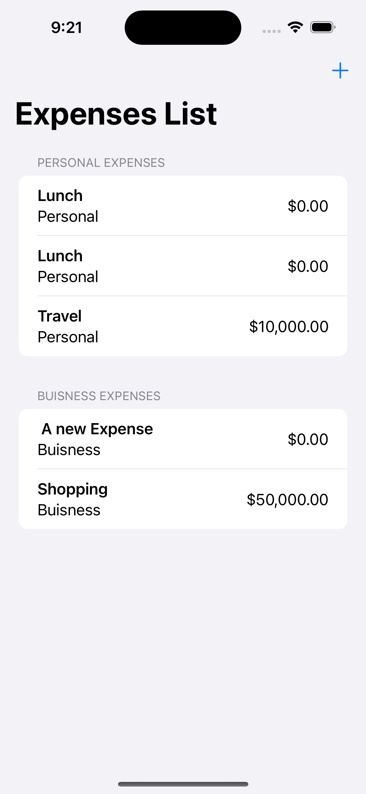

# IExpense

IExpense is an expenses tracking app developed using SwiftUI during the 100 Days of SwiftUI challenge with Hacking with Swift. The app facilitates efficient management of expenses with two key screens: one for adding expenses and another for viewing all expenses.

## Key Learnings

Throughout the development of this project (Days 36-38), the following crucial skills and concepts were mastered:

- **Sheet Presentation**: Implementation of sheet presentation in SwiftUI for seamless user interaction when adding expenses.

- **List Management**: Utilization of ForEach and onDelete callback to manage and delete items in a list efficiently.

- **User Settings**: Integration of UserDefaults class for storing user settings, allowing for a personalized experience.

- **App Storage Property Wrapper**: Leveraging the AppStorage property wrapper provided by SwiftUI for convenient storage of user data. With UserDefaults, the app can store up to 514KB of user data on the device.

## Screenshots

### Add Expense

Description: The screen where users can add new expenses to the tracking app.

### View Expenses

Description: The screen displaying a list of all expenses for comprehensive tracking and management.

## Getting Started

To run this project locally, follow these steps:

1. Clone the repository to your local machine.
2. Open the project in Xcode.
3. Build and run the project on the desired simulator or device.

## Acknowledgments

This project was developed as part of the 100 Days of SwiftUI challenge by Hacking with Swift. Acknowledgment and gratitude to [Hacking with Swift](https://www.hackingwithswift.com/100/swiftui/38) for the invaluable learning resources and guidance.

